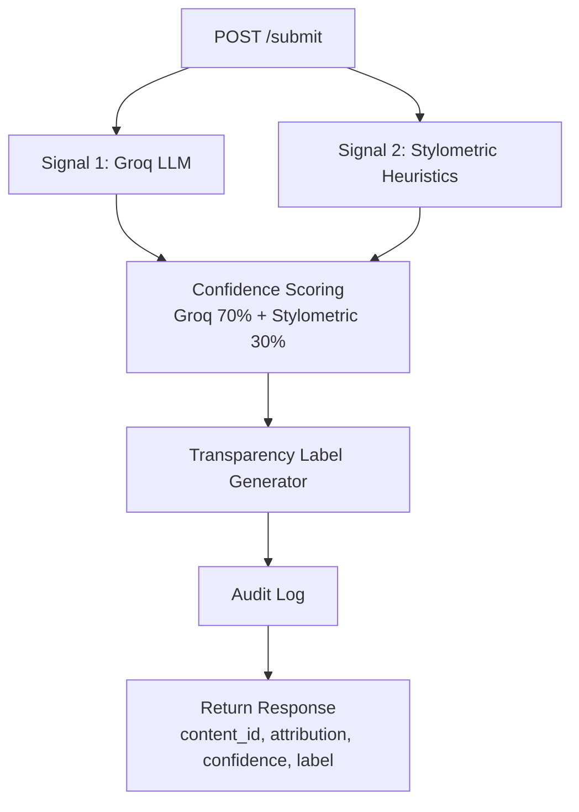
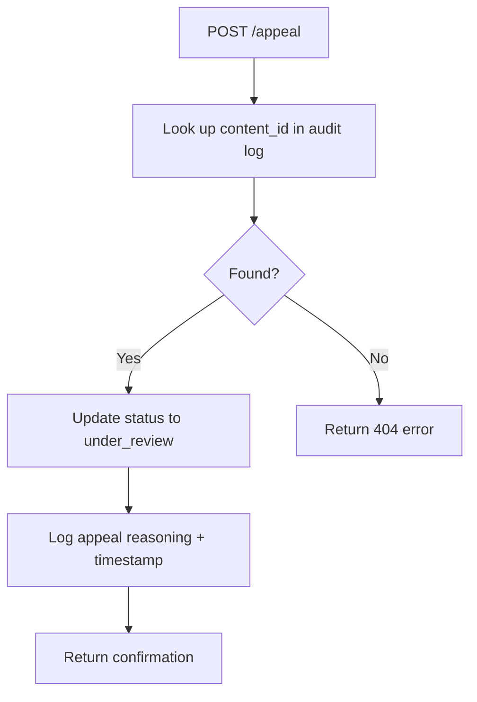

# Provenance Guard

A backend content attribution system that classifies submitted text as human-written or AI-generated, scores confidence in that classification, surfaces a transparency label to users, and handles appeals from creators who believe they've been misclassified.

Built with Flask, Groq (llama-3.3-70b-versatile), and stylometric heuristics.

---

## Architecture

### Submission Flow



### Appeal Flow



### API Endpoints
| Endpoint | Method | Purpose |
|---|---|---|
| `/submit` | POST | Accept text, run detection, return result |
| `/appeal` | POST | Accept content_id + reasoning, log appeal |
| `/log` | GET | Return all audit log entries |

---

## Detection Signals

Provenance Guard uses two independent signals to classify content. "Independent" means they capture genuinely different properties of the text — one semantic, one structural — so their combination is more informative than either alone.

### Signal 1 — Groq LLM Classification (Weight: 70%)
The text is sent to `llama-3.3-70b-versatile` with a prompt asking it to assess whether the writing reads as human or AI-generated. The model returns a score between 0.0 and 1.0 and a brief reasoning explanation.

**What it captures:** Semantic coherence, stylistic naturalness, and holistic writing patterns that are difficult to reduce to statistics.

**Blind spot:** Highly polished human writing — academic papers, formal essays — may score high because the model associates formal structure with AI output.

### Signal 2 — Stylometric Heuristics (Weight: 30%)
A pure Python function that computes two statistical properties of the text:

- **Sentence length variance:** AI text tends to have more uniform sentence lengths. Low variance scores higher (more AI-like).
- **Type-token ratio (TTR):** Vocabulary diversity. AI text reuses words more. Low TTR scores higher (more AI-like).

**What it captures:** Surface-level structural uniformity that differs statistically between human and AI writing.

**Blind spot:** Short texts (under ~100 words) don't provide enough data for these statistics to be meaningful. The signal is unreliable at short lengths.

### Why These Two Together
Signal 1 is semantic — it understands meaning and style holistically. Signal 2 is structural — it measures raw statistical properties without understanding content. A text can fool one signal while triggering the other, making the combination more robust than either alone.

---

## Confidence Scoring

The two signal scores are combined into a single confidence score using a weighted average:

confidence = (llm_score*0.7) + (stylo_score*0.3)

Signal 1 (Groq) is weighted higher because semantic patterns are more reliable than structural ones across different writing styles and genres. The stylometric signal supports or moderates the LLM score but does not override it.

### Threshold Mapping
| Confidence Score | Attribution | Label Variant |
|---|---|---|
| 0.0 – 0.39 | `likely_human` | High-Confidence Human |
| 0.40 – 0.69 | `uncertain` | Uncertain |
| 0.70 – 1.0 | `likely_ai` | High-Confidence AI |

The uncertain band is intentionally wide to protect creators from false positives. The system only labels content as AI-generated when confidence is 0.70 or above.

### Example Scores

**High-confidence AI text:**
> "Artificial intelligence represents a transformative paradigm shift in modern society..."

```json
{
  "llm_score": 0.7,
  "stylo_score": 0.035,
  "confidence": 0.5,
  "attribution": "uncertain"
}
```

**Likely human text:**
> "ok so i finally tried that new ramen place downtown and honestly? underwhelming..."

```json
{
  "llm_score": 0.2,
  "stylo_score": 0.038,
  "confidence": 0.151,
  "attribution": "likely_human"
}
```

The two scores are meaningfully different (0.5 vs 0.151), mapping to different label categories. The AI text lands in "uncertain" rather than "likely_ai" because the stylometric signal is weak on short texts — an honest reflection of the system's uncertainty on limited data.

---

## Transparency Label Variants

The label returned by `/submit` changes based on the confidence score. All three variants are reachable by submitting inputs that produce different confidence levels.

### High-Confidence AI (confidence ≥ 0.70)
> "Our system has determined that this content was likely generated by an AI tool. This label is based on an analysis of writing patterns and style. If you are the creator and believe this is incorrect, you can submit an appeal."

### Uncertain (confidence 0.40 – 0.69)
> "Our system was unable to make a confident determination about whether this content was written by a human or generated by AI. The signals were mixed. If you are the creator and believe this label is inaccurate, you can submit an appeal."

### High-Confidence Human (confidence < 0.40)
> "Our system has determined that this content was likely written by a human. This label is based on an analysis of writing patterns and style."

### Design Decisions
- The uncertain band is wide (0.40–0.69) because a false positive — wrongly labeling a human writer's work as AI — is worse than a false negative on a creative platform.
- Only the AI and uncertain labels include an appeal prompt, since a human label is the favorable outcome and unlikely to be contested.
- All label text is written in plain language for a non-technical reader.

---

## Appeals Workflow

Creators who believe their content was misclassified can submit an appeal via `POST /appeal`.

### How to Submit an Appeal
Send a POST request with the `content_id` returned from `/submit` and a plain-language explanation:

```json
{
  "content_id": "84fee7a2-e61f-4c78-9b12-7729cfff8e16",
  "creator_reasoning": "I wrote this myself from personal experience. I am a non-native English speaker and my writing style may appear more formal than typical."
}
```

### What the System Does
1. Looks up the `content_id` in the audit log
2. Updates the content status from `"classified"` to `"under_review"`
3. Records the creator's reasoning and an appeal timestamp alongside the original decision
4. Returns a confirmation to the creator

### Sample Appeal Response
```json
{
  "message": "Your appeal has been received and is under review.",
  "content_id": "84fee7a2-e61f-4c78-9b12-7729cfff8e16",
  "status": "under_review"
}
```

### Sample Audit Log Entry After Appeal
```json
{
  "appeal_reasoning": "I wrote this myself from personal experience. I am a non-native English speaker and my writing style may appear more formal than typical.",
  "appeal_timestamp": "2026-06-29T03:47:03.941036+00:00",
  "attribution": "uncertain",
  "confidence": 0.5,
  "content_id": "84fee7a2-e61f-4c78-9b12-7729cfff8e16",
  "creator_id": "test-user-1",
  "llm_score": 0.7,
  "status": "under_review",
  "stylo_score": 0.035,
  "timestamp": "2026-06-29T03:45:49.499455+00:00"
}
```

Automated re-classification is not performed on appeal. The appeal is flagged for human review.

---

## Rate Limiting

Rate limiting is applied to the `POST /submit` endpoint using Flask-Limiter with in-memory storage.

### Limits
| Window | Limit |
|---|---|
| Per minute | 10 requests |
| Per day | 100 requests |

### Reasoning
- **10 per minute:** A legitimate creator submitting their own work would rarely send more than a few submissions per minute. 10 is generous enough for normal use while blocking scripts that flood the endpoint.
- **100 per day:** A prolific creator might submit many pieces in a day, but 100 is a reasonable ceiling that prevents systematic abuse while not penalizing active users.

### Rate Limit Evidence
Running 12 rapid requests against the endpoint produces 10 successful responses followed by 2 rejections:
200
200
200
200
200
200
200
200
200
200
429
429
A `429 Too Many Requests` response is returned when the limit is exceeded.
---

## Known Limitations

### Short text reliability
Texts under ~100 words do not provide enough data for the stylometric signal to be meaningful. Sentence length variance and type-token ratio are unreliable at short lengths, so the system effectively relies on Signal 1 alone for short submissions. This can produce overconfident scores in either direction.

### Non-native English speakers
Human writers who are not native English speakers may write in a more formal, uniform style that resembles AI output. Both signals may flag this writing as AI-like, producing a false positive even at moderate confidence. The appeals workflow is the primary mitigation for this case.

### Lightly edited AI output
A user who generates text with AI and then manually edits it may produce content that scores in the uncertain range. Neither signal is designed to detect partial AI involvement — only fully AI-generated vs. fully human-written patterns.

---

## Spec Reflection

**Where the spec helped:** Writing out the three label variants in planning.md before building forced a concrete decision about what 0.5 means to a user. Without that, the label text would have been vague and the threshold arbitrary. Having the exact strings written down made the `generate_label` function straightforward to implement.

**Where implementation diverged:** The planning.md spec assigned Signal 2 a 40% weight. During Milestone 4 testing, the stylometric signal produced nearly identical scores for clearly AI and clearly human text on short inputs, so the weight was reduced to 30% and Groq's weight increased to 70%. The signals section in planning.md documents the original intent; the README reflects the final implementation.

---

## AI Usage

**Instance 1 — Flask app skeleton and Signal 1 function:**
I provided the detection signals section and architecture diagram from planning.md and asked Claude to generate the Flask app skeleton with a POST /submit route stub and the Groq signal function. The generated function returned a binary label instead of a float score, which didn't match the spec. I revised the prompt to specify the exact return format and corrected the output before integrating it.

**Instance 2 — Confidence scoring logic:**
I provided the uncertainty representation section and asked Claude to generate the scoring function combining both signals. The generated function used equal 50/50 weighting, which diverged from the 60/40 split in my spec. I corrected the weights and later adjusted them again to 70/30 after testing revealed the stylometric signal was weak on short texts.

---

## Audit Log Sample

To view the current audit log, run the Flask server and call:

```bash
curl -s http://localhost:5000/log
```

The log captures: timestamp, content ID, creator ID, attribution result, confidence score, both individual signal scores, status, and appeal details if filed.